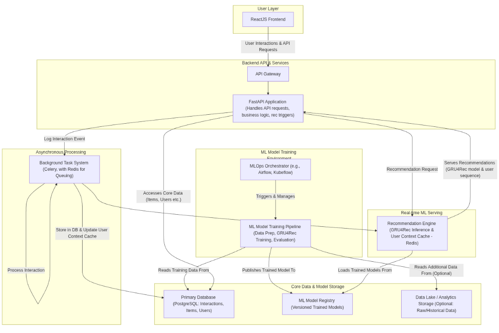

<a name="readme-top"></a>

<!-- PROJECT LOGO -->
<br />
<div align="center">
  <h3 align="center">Full Stack Machine Learning Recommendation System</h3>

  <p align="center">
    A complete ML movie recommendation system with React frontend and FastAPI backend
    <br />
    <a href="https://github.com/george-mountain/full-stack-recommendation-system"><strong>Explore the docs »</strong></a>
    <br />
    <br />
    <a href="http://localhost:5173/">View Demo</a>
    ·
    <a href="https://github.com/george-mountain/full-stack-recommendation-system/issues">Report Bug</a>
    ·
    <a href="https://github.com/george-mountain/full-stack-recommendation-system/issues">Request Feature</a>
  </p>
</div>

<!-- TABLE OF CONTENTS -->
<details>
  <summary>Table of Contents</summary>
  <ol>
    <li>
      <a href="#about-the-project">About The Project</a>
      <ul>
        <li><a href="#built-with">Built With</a></li>
      </ul>
    </li>
    <li>
      <a href="#system-architecture">System Architecture</a>
    </li>
    <li>
      <a href="#getting-started">Getting Started</a>
      <ul>
        <li><a href="#prerequisites">Prerequisites</a></li>
        <li><a href="#installation">Installation</a></li>
      </ul>
    </li>
    <li><a href="#project-structure">Project Structure</a></li>
    <li><a href="#usage">Usage</a></li>
    <li><a href="#license">License</a></li>
    <li><a href="#contact">Contact</a></li>
  </ol>
</details>

<!-- ABOUT THE PROJECT -->
## About The Project

This project is a full-stack Machine Learning movie recommendation system featuring:

- React-based frontend with responsive UI
- FastAPI backend with GRU4Rec recommendation model
- User authentication and rating system
- Admin interface for content management
- Scheduled model retraining with Celery

The system provides personalized movie recommendations based on user ratings and behavior with the help of machine learning model.

<p align="right">(<a href="#readme-top">back to top</a>)</p>

### Built With

* [![FastAPI][FastAPI-shield]][FastAPI-url]
* [![React][React.js]][React-url]
* [![Postgres][Postgres-shield]][Postgres-url]
* [![Docker][Docker-shield]][Docker-url]
* [![Celery][Celery-shield]][Celery-url]

<p align="right">(<a href="#readme-top">back to top</a>)</p>

<!-- SYSTEM ARCHITECTURE -->
## System Architecture

<div align="center">
  
</div>

The architecture diagram above illustrates the main components of the recommendation system:
1. **Frontend**: React-based user interface
2. **Backend**: FastAPI server handling requests
3. **Database**: PostgreSQL for data persistence
4. **Recommendation Engine**: GRU4Rec model for personalized recommendations
5. **Celery Worker**: Background tasks for model training
6. **Redis**: Message broker for task queue

<p align="right">(<a href="#readme-top">back to top</a>)</p>

[video_demo_rec_system.webm](https://github.com/user-attachments/assets/f0e759f9-a774-4cc6-ac8e-fdf041a82bc9)


<!-- GETTING STARTED -->
## Getting Started

To get a local copy up and running follow these simple steps.

### Prerequisites

- Docker and Docker Compose
- Node.js (for frontend development)
- Python 3.8+ (for backend development)

### Installation

1. Clone the repo
   ```sh
   git clone https://github.com/george-mountain/full-stack-recommendation-system.git
   ```
2. Copy environment file
   ```sh
   cp .env.example .env
   ```
3. Start the backend API container
   ```sh
   docker compose up --build
   ```
4. Populate the database with movie data
   ```sh
   docker compose exec app python /app/scripts/seed_db.py
   ```
5. Navigate to frontend and install dependencies
   ```sh
   cd recommendation-frontend/
   npm install
   npm run dev
   ```

<p align="right">(<a href="#readme-top">back to top</a>)</p>

<!-- PROJECT STRUCTURE -->
## Project Structure

### Backend API Structure
```
.
├── app/
│   ├── __init__.py
│   ├── main.py                 # FastAPI app, routers
│   ├── core/
│   │   ├── __init__.py
│   │   └── config.py           # Settings and configurations
│   ├── db/
│   │   ├── __init__.py
│   │   ├── base_class.py       # Base for SQLAlchemy models
│   │   ├── models.py           # SQLAlchemy ORM models (User, Movie, Rating)
│   │   ├── session.py          # Async database session setup
│   │   └── crud.py             # CRUD operations
│   ├── schemas/
│   │   ├── __init__.py
│   │   ├── movie.py            # Pydantic schemas for movies
│   │   ├── rating.py           # Pydantic schemas for ratings
│   │   ├── user.py             # Pydantic schemas for users
│   │   └── token.py            # Pydantic schemas for JWT tokens
│   ├── api/
│   │   ├── __init__.py
│   │   ├── deps.py             # Dependencies (e.g., get_db, get_current_user)
│   │   └── v1/
│   │       ├── __init__.py
│   │       ├── api.py          # API router aggregation
│   │       └── endpoints/
│   │           ├── __init__.py
│   │           ├── users.py
│   │           ├── movies.py
│   │           ├── ratings.py
│   │           └── recommendations.py
│   ├── services/
│   │   ├── __init__.py
│   │   └── recommender/
│   │       ├── __init__.py
│   │       ├── model.py        # GRU4Rec Keras model definition
│   │       ├── predict.py      # Prediction logic
│   │       ├── preprocessing.py # Data preprocessing for training/prediction
│   │       └── train.py        # Training script for the model
│   ├── worker/
│   │   ├── __init__.py
│   │   ├── celery_app.py       # Celery app instance and beat schedule
│   │   └── tasks.py            # Celery tasks (e.g., model training)
│   └── security.py             # Password hashing and JWT utilities
├── data/                         # To store movielens raw data (optional, for initial seeding)
│   └── ml-1m/                    # Extracted movielens data (if downloaded)
├── models_store/                 # To save trained Keras models
│   └── gru4rec_model.keras       # Example saved model
├── Dockerfile
├── docker-compose.yml
├── requirements.txt
└── .env_example                  # Example environment variables
```

### Frontend Structure
```
recommendation-frontend/
├── node_modules/
├── public/
└── src/
    ├── assets/
    ├── components/
    │   ├── Admin/
    │   │   └── AdminPage.jsx
    │   ├── Auth/
    │   │   └── AuthForm.jsx
    │   ├── Common/
    │   │   ├── DisplayAverageRating.jsx
    │   │   ├── LoadingSpinner.jsx
    │   │   ├── MessageBox.jsx
    │   │   ├── MovieCard.jsx
    │   │   ├── RatingModal.jsx
    │   │   └── StarRatingInput.jsx
    │   └── Icons/
    │       ├── ArrowLeftIcon.jsx
    │       ├── FilmIcon.jsx
    │       ├── FilterIcon.jsx
    │       ├── HomeIcon.jsx
    │       ├── LockIcon.jsx
    │       ├── LogOutIcon.jsx
    │       ├── MenuIcon.jsx
    │       ├── SearchIcon.jsx
    │       ├── SettingsIcon.jsx
    │       ├── StarIcon.jsx
    │       ├── ThumbsUpIcon.jsx
    │       ├── TrashIcon.jsx
    │       ├── UploadCloudIcon.jsx
    │       ├── UserIcon.jsx
    │       └── XIcon.jsx
    ├── contexts/
    │   ├── AppContext.jsx
    │   └── AuthContext.jsx
    ├── Layout/
    │   ├── Footer.jsx
    │   └── Navbar.jsx
    └── pages/
    |   ├── HomePage.jsx
    |   └── MovieDetailPage.jsx
    └── services/
    |    ├── ApiService.js
    |   
    |
    └── styles/
        ├── index.css
```

<p align="right">(<a href="#readme-top">back to top</a>)</p>

<!-- USAGE -->
## Usage

After installation, access the services via:

- Backend API docs: http://127.0.0.1:8000/docs
- Frontend: http://localhost:5173/
- PGAdmin: http://localhost:5050/ (credentials: admin@admin.com / admin1234)

**Admin Access:**
1. Register with email: `admin@example.com`
2. Login and access the admin page
3. Manage movies and retrain the recommendation model

<p align="right">(<a href="#readme-top">back to top</a>)</p>

<!-- LICENSE -->
## License

Distributed under the MIT License. See `LICENSE.txt` for more information.

<p align="right">(<a href="#readme-top">back to top</a>)</p>

<!-- CONTACT -->
## Contact

Project Link: [https://github.com/george-mountain/full-stack-recommendation-system](https://github.com/george-mountain/full-stack-recommendation-system)

<p align="right">(<a href="#readme-top">back to top</a>)</p>

<!-- MARKDOWN LINKS & IMAGES -->
[forks-shield]: https://img.shields.io/github/forks/george-mountain/full-stack-recommendation-system.svg?style=for-the-badge
[forks-url]: https://github.com/george-mountain/full-stack-recommendation-system/network/members
[stars-shield]: https://img.shields.io/github/stars/george-mountain/full-stack-recommendation-system.svg?style=for-the-badge
[stars-url]: https://github.com/george-mountain/full-stack-recommendation-system/stargazers
[issues-shield]: https://img.shields.io/github/issues/george-mountain/full-stack-recommendation-system.svg?style=for-the-badge
[issues-url]: https://github.com/george-mountain/full-stack-recommendation-system/issues
[license-shield]: https://img.shields.io/github/license/george-mountain/full-stack-recommendation-system.svg?style=for-the-badge
[license-url]: https://github.com/george-mountain/full-stack-recommendation-system/blob/master/LICENSE.txt
[FastAPI-shield]: https://img.shields.io/badge/FastAPI-005571?style=for-the-badge&logo=fastapi
[FastAPI-url]: https://fastapi.tiangolo.com/
[React.js]: https://img.shields.io/badge/React-20232A?style=for-the-badge&logo=react&logoColor=61DAFB
[React-url]: https://reactjs.org/
[Postgres-shield]: https://img.shields.io/badge/PostgreSQL-316192?style=for-the-badge&logo=postgresql&logoColor=white
[Postgres-url]: https://www.postgresql.org/
[Docker-shield]: https://img.shields.io/badge/Docker-2CA5E0?style=for-the-badge&logo=docker&logoColor=white
[Docker-url]: https://www.docker.com/
[Celery-shield]: https://img.shields.io/badge/Celery-37814A?style=for-the-badge&logo=celery&logoColor=white
[Celery-url]: https://docs.celeryq.dev/
